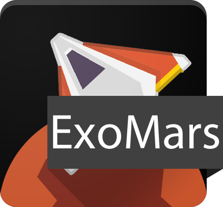

# ExoMars

ExoMars is a simple mobile game for Android which utilises an acceleration sensor for steering. It's a student project at the Karlsruhe Institute of Technology (KIT), which was implemented for the course "Mobile Computing und Internet der Dinge".

Plugins used:

* Acceleration sensor
* Vibration motor
* Storage

Libraries used:

* [PhoneGap](http://phonegap.com)
* [Zepto.js](http://zeptojs.com)
* [Backbone.js](http://backbonejs.org)
* [Phaser](http://phaser.io)

Assets uses:

* [Mobile Game GUI](http://graphicburger.com/mobile-game-gui)
* [SPACE SHOOTER REDUX](http://kenney.nl/assets/space-shooter-redux)
* [Launcher Icon Template](http://appicontemplate.com/android)
